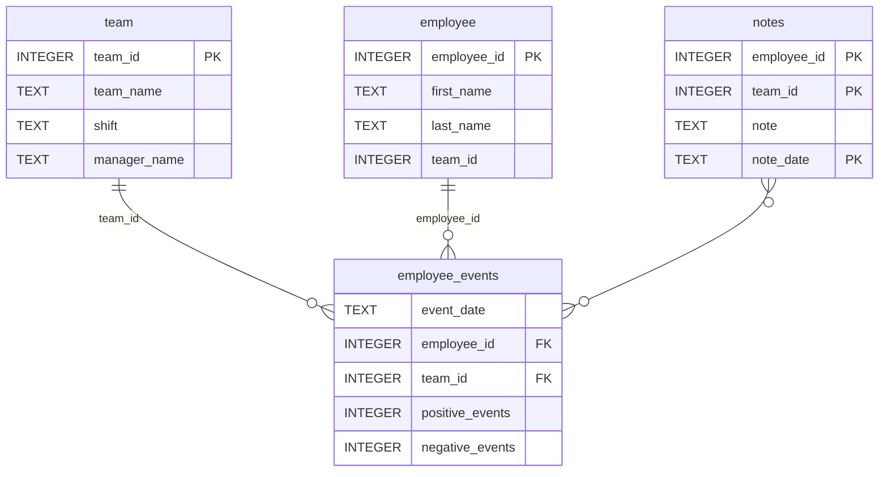

# Employee Events

This is a web-based dashboard built using **FastHTML** and **Matplotlib**, providing various visualizations and filtering options for **Employee** and **Team** data. The dashboard allows users to view and interact with event data, predicted recruitment risks, and notes associated with specific employees or teams. The primary features include dynamic data visualizations, an interactive filter for selecting between employee or team profiles, and the ability to update visualizations based on the selected profile type.

## Features

- **Interactive Dropdown**: Select between "Employee" or "Team" to filter the displayed data and adjust the visualizations accordingly.
- **Dynamic Data Visualization**: Displays two main visualizations:
  - **Line Chart**: Shows the cumulative count of positive and negative events over time.
  - **Bar Chart**: Displays predicted recruitment risk using a machine learning model.
- **Notes Table**: A table displaying notes related to the selected employee or team.
- **Real-time Updates**: When a user selects a different profile (Employee/Team), the dashboard updates automatically to reflect the relevant data.
- **User-Friendly Interface**: Simple and intuitive design allowing users to easily navigate through the dashboard.

## Components

### 1. **ReportDropdown**
   - A custom dropdown component that allows users to select between employee or team profiles.
   - Dynamically fetches data based on the selected profile type.

### 2. **Header**
   - Displays the name of the selected profile (Employee or Team) as a heading.

### 3. **LineChart**
   - Displays a **Line Chart** visualization showing cumulative event counts (positive and negative) over time.
   - Uses **Matplotlib** to plot the data, and **Pandas** to process and manipulate the data.

### 4. **BarChart**
   - Displays a **Bar Chart** visualization of predicted recruitment risk for the selected employee or team.
   - The prediction is made using a machine learning model.

### 5. **NotesTable**
   - A table displaying notes associated with the selected profile (Employee or Team).
   - The data is fetched dynamically based on the selected ID.

### 6. **DashboardFilters**
   - Includes a **Radio Button** to toggle between Employee and Team, and a **Dropdown** to select the user (Employee or Team) from the list.

### 7. **Visualizations**
   - Combines the **LineChart** and **BarChart** into a single component to be displayed in the dashboard.

### 8. **Report**
   - The main container that combines all the components (Header, Filters, Visualizations, and NotesTable).

## Routing

The web application provides the following routes:

- `/`: Displays the dashboard with default data for an employee with ID 1.
- `/employee/{employee_id}`: Displays the dashboard for a specific employee based on the employee ID passed in the URL.
- `/team/{team_id}`: Displays the dashboard for a specific team based on the team ID passed in the URL.
- `/update_dropdown`: Updates the dropdown options based on the selected profile type (Employee or Team).
- `/update_data`: Handles the form submission, redirects the user to the selected employee or team profile page.

## Requirements

- **Python 3.x**
- **FastHTML**: A Python web framework for building web apps.
- **Matplotlib**: A library for creating static, animated, and interactive visualizations in Python.
- **Pandas**: A library for data manipulation and analysis.
- **Scikit-learn**: For machine learning model predictions.
- **FastAPI**: Used for building the web API routes.

## Setup and Installation

To set up and run the dashboard locally, follow these steps:

1. Clone the repository:
   ```bash
   git clone https://github.com/your-repository-url.git
   cd your-repository-directory
   ```

2. Create a virtual environment and activate it:

  ```bash
  python -m venv venv
  source venv/bin/activate  # On Windows use `venv\Scripts\activate`
  ```

3. Install the required dependencies:

  ```bash
  pip install -r requirements.txt
  ```

4. Run the app:

  ```bash
  python app.py
  ```

5. Visit http://127.0.0.1:8000 in your web browser to view the dashboard.

## License

This project is licensed under the MIT License - see the LICENSE file for details.

## Repository

### Repository Structure
```
├── README.md
├── assets
│   ├── model.pkl
│   └── report.css
├── env
├── python-package
│   ├── employee_events
│   │   ├── __init__.py
│   │   ├── employee.py
│   │   ├── employee_events.db
│   │   ├── query_base.py
│   │   ├── sql_execution.py
│   │   └── team.py
│   ├── requirements.txt
│   ├── setup.py
├── report
│   ├── base_components
│   │   ├── __init__.py
│   │   ├── base_component.py
│   │   ├── data_table.py
│   │   ├── dropdown.py
│   │   ├── matplotlib_viz.py
│   │   └── radio.py
│   ├── combined_components
│   │   ├── __init__.py
│   │   ├── combined_component.py
│   │   └── form_group.py
│   ├── dashboard.py
│   └── utils.py
├── requirements.txt
├── start
├── tests
    └── test_employee_events.py
```

### employee_events.db


